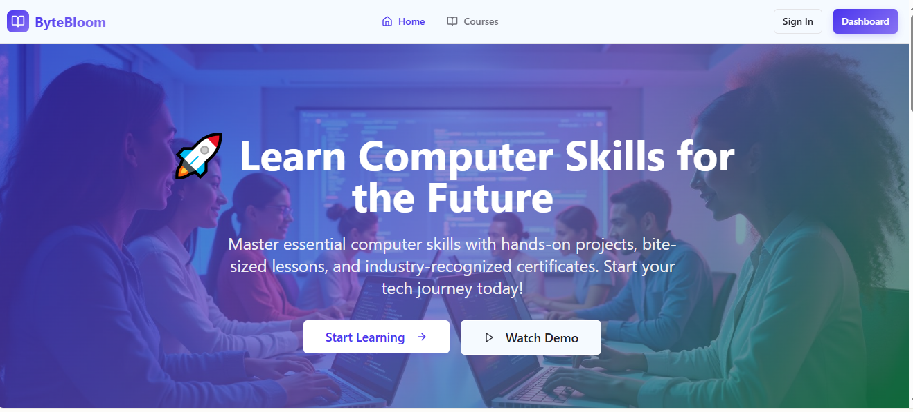

# 💻 Computer Courses MVP

## 📌 Project Title
**Computer Courses MVP Platform**

**URL**: https://lovable.dev/projects/ec47c396-3020-4c68-9fa2-4414b194fca8

## 📖 Project Description
A lightweight and modern MVP for an e-learning platform that offers beginner-friendly computer courses.  
The platform includes a landing page, responsive navigation, a demo video link, login system with dummy credentials, and a student dashboard showcasing available courses.

## ✨ Features
- Responsive landing page with a **Watch Demo** button linked to YouTube  
- Modern UI with **shadcn-ui** components + **Tailwind CSS**  
- **Login Page** with pre-filled credentials  
- **Dashboard** with dummy courses and progress tracking placeholders  
- Responsive navigation bar with Sign In and Dashboard buttons  
- Logout functionality returning to login page  
- Simple front-end routing with React Router  

## 🎓 Courses Offered
1. Digital Literacy & Productivity  
2. Programming Foundations (Python)  
3. Web Development Essentials (HTML, CSS, JavaScript)  
4. Data & Databases (SQL, Python Basics)  
5. Networking & Cybersecurity Basics  
6. Emerging Tech Awareness (AI, Blockchain, Cloud)  

## 🎥 Demo or Screenshots
- Watch Demo: [Introduction to Computer YouTube Lecture](https://www.youtube.com)  
- Screenshots: 
 
 
  
  

## ⚙️ Setup and Usage
1. Clone the repository:  
   ```bash
   git clone https://github.com/benoond/byte-bloom-school.git
   cd computer-courses-mvp
   ```

2. Install dependencies:  
   ```bash
   npm install
   ```

3. Start the development server:  
   ```bash
   npm run dev
   ```

4. Open the app in your browser at:  
   ```
   http://localhost:5173
   ```

### Dummy Login Credentials
- Email: `student@example.com`  
- Password: `password123`  

After logging in, you’ll be redirected to the **Dashboard**.

## 🎨 Design Philosophy
The design emphasizes **simplicity, clarity, and accessibility**:  
- Minimalistic interface with **rounded cards and soft shadows**  
- **Mobile-first, responsive design**  
- Clean typography and intuitive navigation  
- Engaging UI with project-based learning approach  

## 🛠 Tech Stack
- ⚡ Vite  
- 🟦 TypeScript  
- ⚛️ React  
- 🎨 shadcn-ui  
- 🌀 Tailwind CSS  
- 📍 React Router  

## 🚀 Future Plans
- Connect authentication and data storage with **Supabase**  
- Add interactive coding playgrounds for Python & Web development  
- Introduce gamification (badges, points, streaks)  
- Enable user profiles with certificates and progress tracking  
- Mobile offline access to notes and lessons  

## 🤝 Contributing
Contributions are welcome! 🎉 
1. Fork the repository  
2. Create a new branch (`feature/my-feature`)  
3. Commit your changes (`git commit -m "Add my feature"`)  
4. Push to the branch (`git push origin feature/my-feature`)  
5. Open a Pull Request  

## 📧 Contact or Support
For inquiries or support, contact:  
**Email:** support@computercoursesmvp.com  

## 📜 License
This project is licensed under the MIT License.  
See the LICENSE file for details.  
